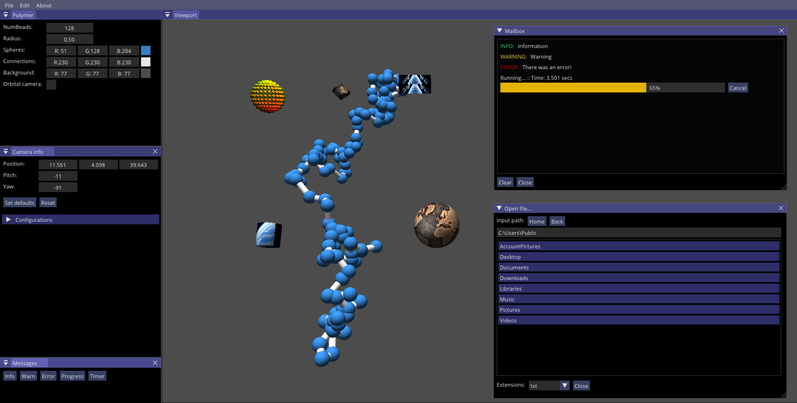

# GRender

GRender is an utility that wraps ImGui, ImPlot and other OpenGL features for a quick graphical interface design. 

## Template

Usually under template I have some prototyping code with which one can learn how to setup GRender. For now, I have a small program that shows a polymer (Gaussian chain model).

